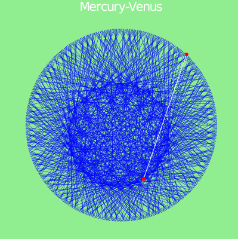
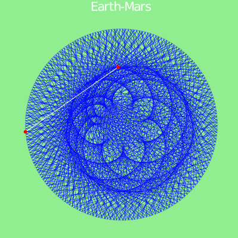
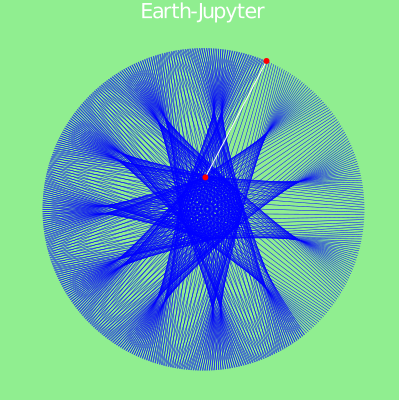

# PlanetaryOrbits.jl
Draw lines between orbits of a pair of planets.

## About
The Pluto Julia notebook `PlanetaryOrbits.jl` draws the lines connecting two planets (`Planet1` and `Planet2`) in 2D projection of their respective heliocentric coordinates from `Date1` until `Date2` in positions which are `δDays` apart.

Planets are `1=Mercury`, `2=Venus`, `3=Earth`, `4=Mars`, `5=Jupyter`, `6=Saturnus`, `7=Uranius`, `8=Neptun`, and `9=Pluto`.

See also [link1](https://en.wikipedia.org/wiki/Orbit#Planetary_orbits) and [link2](https://www.keplerstern.com/signature-of-the-celestial-spheres/) for extended information.

The notebook uses Julia packages [AstroLib.jl](https://github.com/JuliaAstro/AstroLib.jl) and [Plots.jl](https://github.com/JuliaPlots/Plots.jl), and the module  [Dates](https://julia-doc.readthedocs.io/en/latest/manual/dates/).

## Installation and Running
* Download the notebooks (repository) using `git` command:
```
git clone https://github.com/ivanslapnicar/PlanetaryOrbits.jl.git
```
or download the repository directly as zip file.
* Install [Julia](https://julialang.org/downloads/). In Julia terminal run the commands
```
> using Pkg
> Pkg.add("Pluto")
> Pkg.add("Pluto")
```
The above commands need to be executed only once.
* Start the Pluto notebook server: in Julia terminal run
```
> using Pluto
> Pluto.run()
```
* In Pluto notebook server navigate to the notebook and open it.

## Example Images






